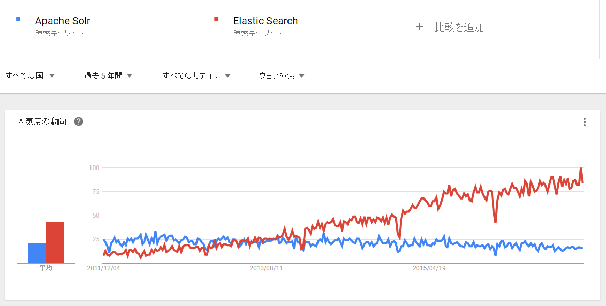
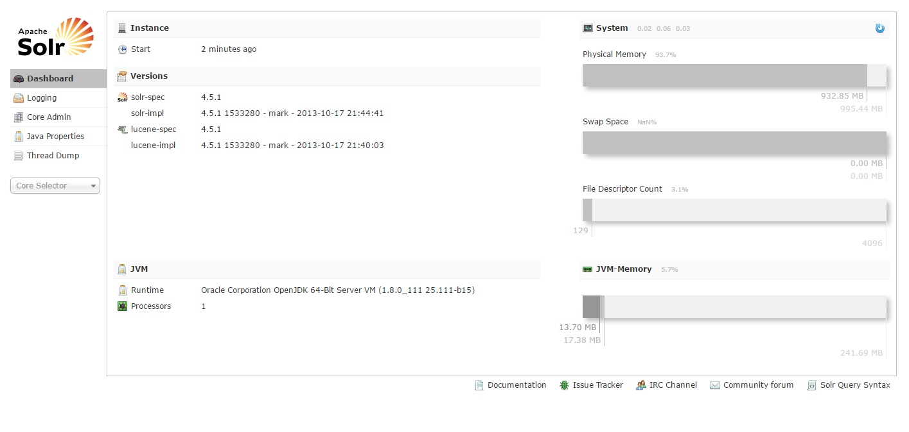
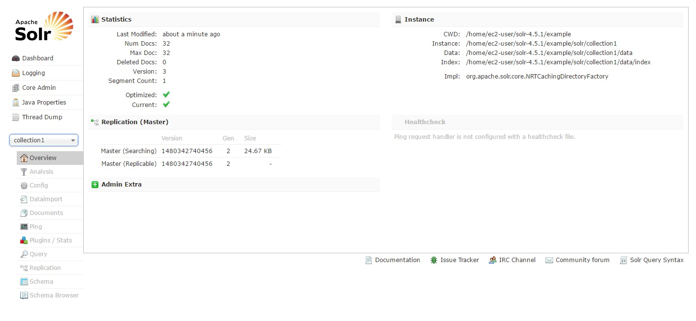
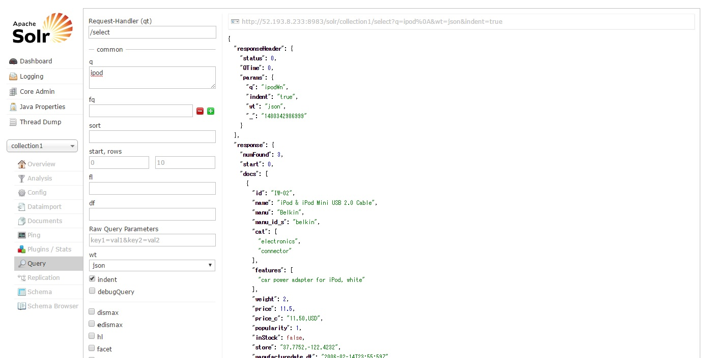
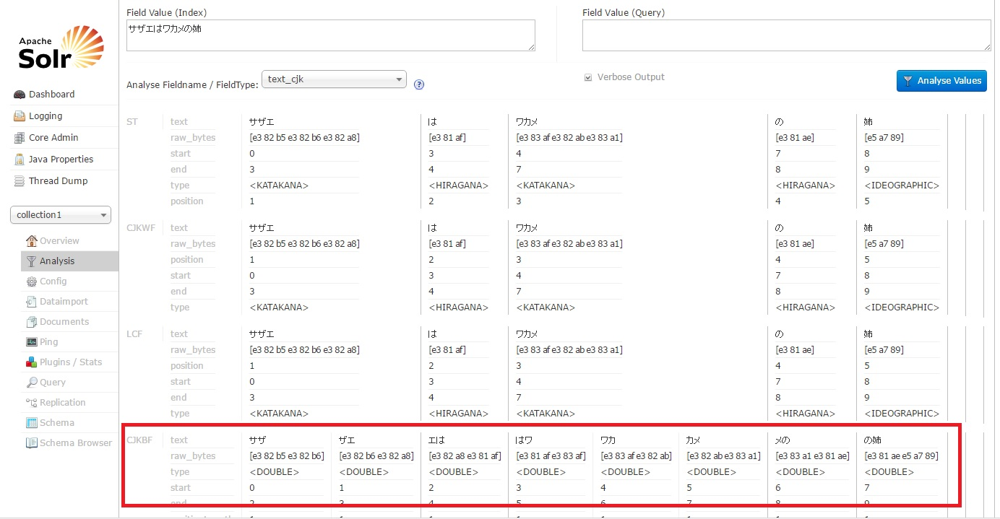
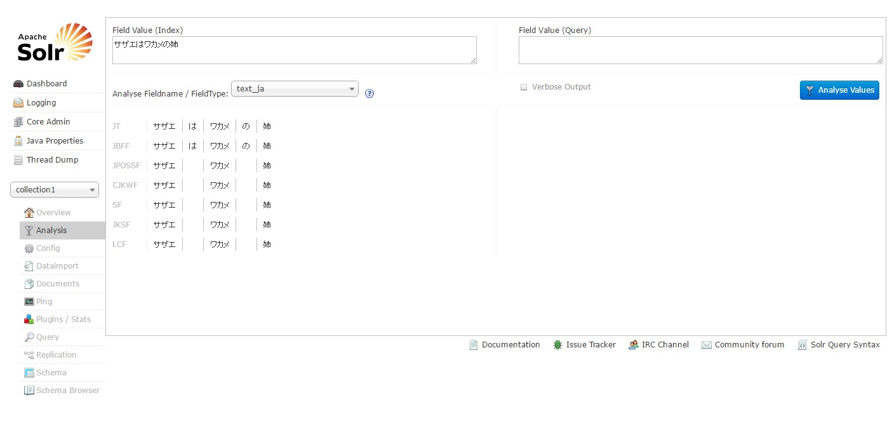
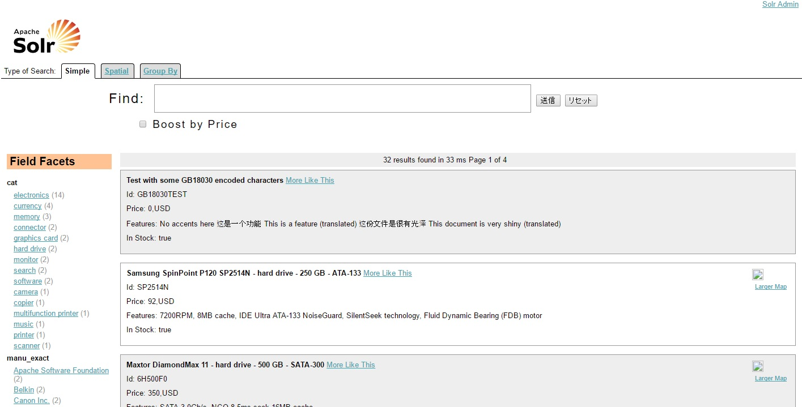

# Apache　Solrとは

Apche Solrとは、Apache Lucene(Javaで作成されたOSSの検索エンジンライブラリ)を使って  
構築されたオープンソースの検索エンジンサーバ

Apache Solrを使わずLuceneのライブラリを使って、  
独自に検索サーバーを作ることはできるが手続きが色々とあり大変

```Java
QueryParser parser = new QueryParser(Version.LUCENE_44, "text", analyzer);
Query query = parser.parse("Solr");
IndexReader reader = DirectoryReaer.open(FSDirectory.open(new File("index")));
IndexSercher searcher = new IndexSearcher(reader);
TopDocs docs = searcher.search(query, 10);
for (ScoreDoc scoreDoc : docs.scoreDocs) {
	...
}
```
Solrではこれらの手間を解消するためのRESTライクなインターフェースを用意しており、  
また機能や使い勝手を向上する仕組みが色々と追加されている

ちなみに、3年前から盛り上がっている検索エンジンであるElastic　SearchもLuceneをベースとしている


### Apache　Solrの仕組み
Apache Solrは検索対象となるドキュメントを取り込み、  
そのドキュメントにはどのような単語を含んでいるのか解析しその情報を蓄えている(これをインデックスという)

このインデックスを利用することで、ユーザが指定した検索キーワードを持つドキュメントを高速で検索することができる

このインデックスを利用しドキュメントを検索することを**転置索引方式**といい、  
SQLのlike検索やgrep検索などのドキュメントの先頭から後方に向かって  
検索キーワードが含まれているか検索する方法を順次検索方式という  
※これ以降は転置索引方式で使用しApache Solrを説明

インデックス(転置索引)の仕組みは下記のような流れとなる  

※よくネットで見るサザエさんを例に説明

1, 下記3つのドキュメントがあるとする

| ドキュメントID | ドキュメント |
|--|--|
| 1 | カツオはサザエの弟 |
| 2 | サザエはワカメの姉 |
| 3 | ワカメはカツオの妹 |

2, 各ドキュメントを単語に分割し、単語とドキュメントIDのマップを作成(インデックスを作成)

| 単語 | ドキュメントID |
|--|--|
| の | 1,2,3 |
| は | 1,2,3 |
| カツオ | 1,3 |
| サザエ | 1,2 |
| ワカメ | 2,3 |
| 姉 | 2 |
| 弟 | 1 |
| 妹 | 3 |

3, ユーザーが検索キーワードとして"サザエ AND ワカメ"検索とした場合、  
検索システムは、"サザエ"と"ワカメ"が含まれるそれぞれのドキュメントIDを調べる

この場合はそれぞれドキュメントIDは下記となるため、論理積であるドキュメントID:2が検索結果となる

| 単語 | ドキュメントID |
|--|--|
| サザエ | 1,**2** |
| ワカメ | **2**,3 |

順次検索方式と転置索引方式のメリット/デメリットは下記となる

* 順次検索方式
	* メリット
		* インデックスを使わないのでリアルタイムに検索できる

	* デメリット
		* 大量のドキュメントの検索には向いていない
		* 多数のユーザから繰り返し検索される状況では非効率

* 転置索引方式
	* メリット
		* 大量ドキュメントを保有し、多数のユーザから繰り返し検索される状況かも効率的に処理できる
		* 大規模検索向き

	* デメリット
		* インデックスをメンテしないといけないため、リアルタイム検索ではない
		* インデックスのサイズが巨大になる

### 形態素解析とN-gram
転置索引を作成するためには、ドキュメントを単語単位に分割する必要がある

日本語は英語と違い、単語の区切りにスペースがなく単語の境界があいまいのため、  
ドキュメントを単語単位に区切ることが難しい

そこでドキュメントから単語を切り出す方法として下記の２つの方法がよく使われている  

| 方式 | 方法 |
|--|--|
|形態素解析|単語辞書をもとに単語に分割|
|N-gram|ドキュメントをN文字単位で分割|

```
例:2-gramの場合  

 ・ 対象ドキュメント
 	- サザエはワカメの姉

 ・ 2-gramで単語に分割
	- サザ／ザエ／エは／はワ／ワカ／カメ／メの／の姉

※N-gramでは検索キーワードも分割する
```

形態素解析とN-gramのメリット/デメリットは下記となる

 * 形態素解析

 	* メリット

 		* 人が見て自然な単語で分割できる

 	* デメリット

 		* 辞書を使用し単語分割するため、辞書に載っていない単語が抽出しにくく、辞書のメンテナンスが必要

 * N-gram

 	* メリット
 		* 辞書を使用しないため、辞書に載っていない単語も抽出できる

 	* デメリット
 		* 機械的に単語を抽出するため、不要な検索結果が混じる可能性がある

### Apache　Solrのインストールし触ってみる

EC2インスタンスにApache Solrをインストール

1, Apache Solrはデフォルトポートが8983を使用するため、セキュリティグループで下記を設定する

 * タイプ：カスタムTCPルール
 * プロトコル：TCP
 * ポート：8983
 * 送信元：0.0.0.0/0

2, [E2の初期設定](/others/aws005.html)

3, Apaceh Solrのダウンロード※実行ユーザはec2-user
```
$ wget https://archive.apache.org/dist/lucene/solr/4.5.1/solr-4.5.1.tgz
--2016-11-28 23:08:54--  https://archive.apache.org/dist/lucene/solr/4.5.1/solr-4.5.1.tgz
Resolving archive.apache.org (archive.apache.org)... 163.172.17.199
Connecting to archive.apache.org (archive.apache.org)|163.172.17.199|:443... connected.
HTTP request sent, awaiting response... 200 OK
Length: 133383663 (127M) [application/x-gzip]
Saving to: ‘solr-4.5.1.tgz’

solr-4.5.1.tgz                100%[==============================================>] 127.20M  2.65MB/s    in 46s     

2016-11-28 23:09:41 (2.79 MB/s) - ‘solr-4.5.1.tgz’ saved [133383663/133383663]
$ ls
solr-4.5.1.tgz
```

今回は参考にした資料が、バージョン4.5であったためそちらをインストール  
そのほかのバージョンは[こちら](https://archive.apache.org/dist/lucene/solr/)よりダウンロード

4, ダウンロードしたtarを展開
```
$tar xvzf solr-4.5.1.tgz
.
.
.
solr-4.5.1/docs/solr-velocity/prettify.js
solr-4.5.1/docs/solr-velocity/resources/inherit.gif
solr-4.5.1/docs/solr-velocity/stylesheet.css
solr-4.5.1/docs/solr.png
solr-4.5.1/docs/tutorial.html
$ ls
solr-4.5.1  solr-4.5.1.tgz
```

5, 起動
```
$ cd solr-4.5.1/example/
$ ls
cloud-scripts  etc          exampledocs         lib   multicore   resources  solr-webapp  webapps
contexts       example-DIH  example-schemaless  logs  README.txt  solr       start.jar
$ java -jar start.jar 
0    [main] INFO  org.eclipse.jetty.server.Server  – jetty-8.1.10.v20130312
38   [main] INFO  org.eclipse.jetty.deploy.providers.ScanningAppProvider  – Deployment monitor /home/ec2-user/solr-4.5.1/example/contexts at interval 0
.
.
.
4107 [searcherExecutor-4-thread-1] INFO  org.apache.solr.handler.component.SpellCheckComponent  – Loading spell index for spellchecker: wordbreak
4107 [searcherExecutor-4-thread-1] INFO  org.apache.solr.core.SolrCore  – [collection1] Registered new searcher Searcher@faa5259 main{StandardDirectoryReader(segments_1:1:nrt)}
```

6, `http://パブリックID：8983/solr/`にアクセスし、管理画面を表示


7, 付属のサンプルデータをSolrに登録
```
$ cd solr-4.5.1/example/exampledocs/
$ ls
books.csv            hd.xml          manufacturers.xml  monitor2.xml  post.jar   solr.xml          vidcard.xml
books.json           ipod_other.xml  mem.xml            monitor.xml   post.sh    test_utf8.sh
gb18030-example.xml  ipod_video.xml  money.xml          mp500.xml     sd500.xml  utf8-example.xml
$ java -jar post.jar *.xml
SimplePostTool version 1.5
Posting files to base url http://localhost:8983/solr/update using content-type application/xml..
POSTing file gb18030-example.xml
POSTing file hd.xml
POSTing file ipod_other.xml
POSTing file ipod_video.xml
POSTing file manufacturers.xml
POSTing file mem.xml
POSTing file money.xml
POSTing file monitor2.xml
POSTing file monitor.xml
POSTing file mp500.xml
POSTing file sd500.xml
POSTing file solr.xml
POSTing file utf8-example.xml
POSTing file vidcard.xml
14 files indexed.
COMMITting Solr index changes to http://localhost:8983/solr/update..
Time spent: 0:00:00.570
```

8, 管理画面で登録したデータを確認


Num Docsが登録されているドキュメントの数となり、32件のデータが登録されている

9, 検索してみる


3件のデータが検索出来た

10, N-gramで文章を解析する


文章が2文字で分割されていることが確認できた

11, 形態素解析で文章を分割する


文章が単語単位で分割されていることが確認できた

※このあたりの仕組みは後述

12, インストールしたSolrをのぞいてみる
```
$ cd solr-4.5.1/example/solr/
$ ls
bin  collection1  README.txt  solr.xml  zoo.cfg
```

solr.xmlがApache Solrの共通的な設定情報

collection1ディレクトリはデフォルトで用意されているApche Solrのコア情報となる

コアとはOracleとかでいう所のスキーマみたいなもの  
コア単位でドキュメントやインデックスを管理している

```
$ cd collection1/conf/
$ ls
admin-extra.html              currency.xml             mapping-ISOLatin1Accent.txt  solrconfig.xml  update-script.js
admin-extra.menu-bottom.html  elevate.xml              protwords.txt                spellings.txt   velocity
admin-extra.menu-top.html     lang                     schema.xml                   stopwords.txt   xslt
clustering                    mapping-FoldToASCII.txt  scripts.conf                 synonyms.txt
```

solrconfig.xmlがSolrの構成を管理ファイルで、  
schema.xmlがインデックスを構成するフィールドや型を管理するファイル

schema.xmlについては後述

##### その他
Apache SolrにはSolrを利用したサンプル検索アプリ"Solritas"が用意されている

ここでSolrの機能を試すことが出来る

URLはhttp://パブリックID:8983/solr/collection1/browse
