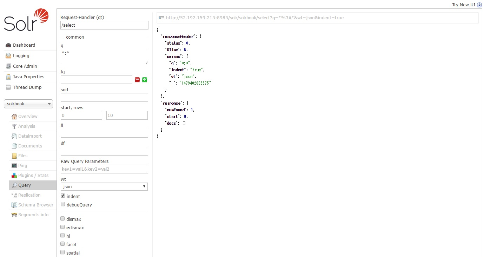
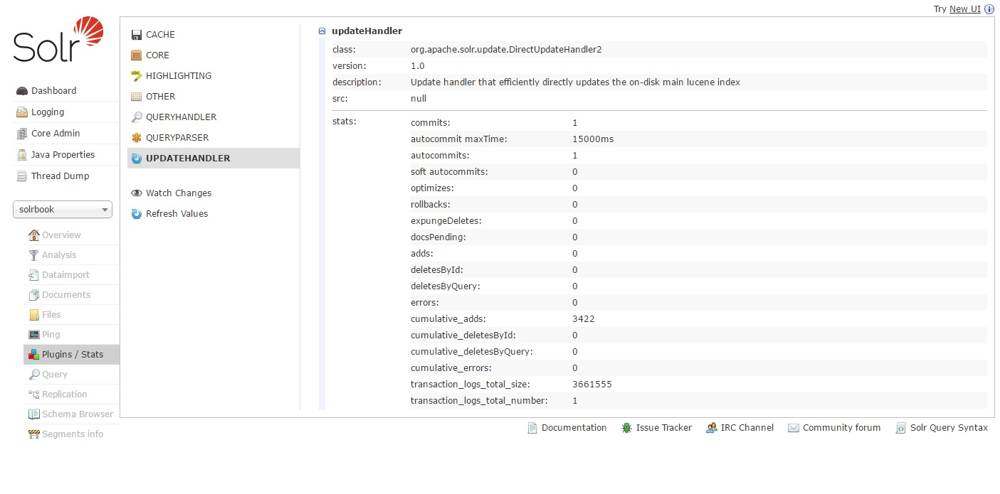
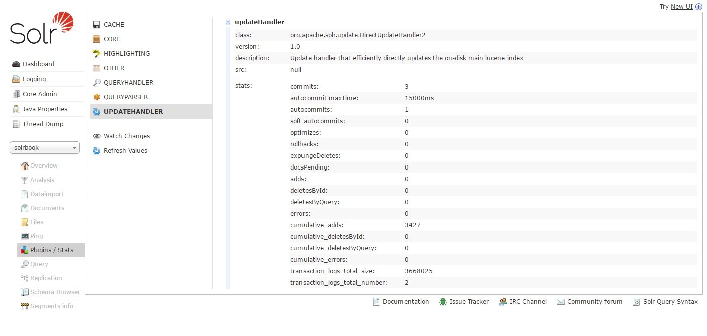
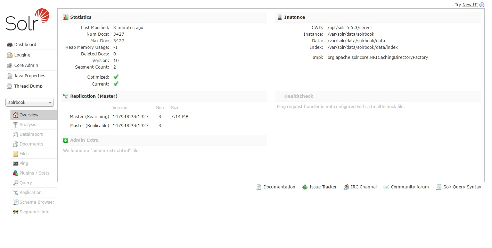

# インデックスの作成

### Solrにドキュメントを登録
XMLファイル/JSONファイル形式によるSolrへのドキュメント登録方法を紹介

#### XMLファイルでの登録
XMLファイルでSolrに登録するドキュメントを用意し、SolrにPOSTすることで登録できる  

書式は下記のような感じ
```
<add>
	<doc>
		<field name="fieldname">fieldvalue</field>
		<field name="fieldname">fieldvalue</field>
		<field name="fieldname">fieldvalue</field>
		<field name="fieldname">fieldvalue</field>
	</doc>
	<doc　boost="3.0">
	...
	</doc>
	<doc>
	...
	</doc>
</add>
```

docタグが登録するドキュメントの単位となる  
またboostタグはそのドキュメントの重要度を表し、  
重要度は検索結果のランキングの元となるスコアの計算に使用されるパラメータ  
また重要でない場合は1.0以下を指定する

sheme.xmlでmultiValue="true"となっているfieldタグは、同じフィールド名を指定することが出来る
```
		<field name="category">fieldvalue</field>
		<field name="category">fieldvalue</field>
		<field name="category">fieldvalue</field>
		<field name="category">fieldvalue</field>
```

ここからは、サンプルXMLをSolrに登録してインデックスを作成する

1, solrbooksコアを作成する
```
$ sudo su - solr
$ /opt/solr/bin/solr create_core -c solrbooks
```

2, [サンプルXML](https://unarranged-articles.github.io/apachesolr/data/sample-books.xml)をダウンロード

3, solrbooksコア配下にダウンロードしたXMLファイルを置く
```
$ sudo cp -p sample-books.* /var/solr/data/solrbook/
$ su -
$ chown solr /var/solr/data/solrbook/sample-books.*
$ su - solr
$ cd /var/solr/data/solrbook/
```

4, XMLファイルをSolrに登録
```
$ curl http://localhost:8983/solr/solrbook/update --data-binary @sample-books.xml -H 'Content-type:text:xml;charset=utf-8'
<?xml version="1.0" encoding="UTF-8"?>
<response>
<lst name="responseHeader"><int name="status">0</int><int name="QTime">3201</int></lst>
</response>
```

5, Solrの管理画面で登録された確認


ドキュメントが登録されておりコミットされている

コミットされているドキュメントは下記で確認ができる


それぞれの意味はこちら

|名前|意味|
|:--|:--|
|commits|コミット数|
|autocommits|自動コミット数|
|soft autocommits|自動ソフトコミット数|
|optimizes|最適化数|
|rollbacks|ロールバック数|
|expungeDeletes|インデックスセグメントファイルのマージに際して削除を行った回数|
|docsPending|未コミットの追加予定ドキュメント数|
|adds|追加ドキュメント数|
|deleteById|ユニークキー指定によるドキュメント削除のリクエスト数|
|deleteByQuery|クエリ指定によるドキュメント削除のリクエスト数(削除されたドキュメント数ではない)|
|errors|エラー数|
|cumulative_*|それぞれの累積|

もしコミットされていない(docsPendingが0でない)場合は、下記コマンドでコミットできる
6, コミットする
```
$ curl http://localhost:8983/solr/solrbook/update?commit=true
```
そのあと、管理画面でRefresh Valuesをすると、docsPendingが0になっているはず

#### JSONファイルによる登録
JSONの書式は下記のような感じ
```
[
{
"summary":"「今すぐ使えるかんたん」の入門者向けシリーズ「ぜったいデキます！」から，インターネット＆メールの登場です。Windows 8で新しく生まれ変わったインターネットとメールの使い方を，手取り足取り，ていねいに解説します。",
"genre":"パソコン",
"genre":"メール・インターネット",
"author":"門脇香奈子",
"pub_time":"2013-06-26T00:00:00Z",
"title":"今すぐ使えるかんたん　ぜったいデキます！　メール＆インターネット　［Windows 8対応版］",
"intended_reader":"Windows 8でインターネットとメールを使いたい方",
"price":"1239",
"pub_date":"20130626",
"isbn":"978-4-7741-5739-9",
"pages":"192",
"url":"http://gihyo.jp/book/2013/978-4-7741-5739-9"
},
...
]
```

サンプルJSONを登録してみる

1, [サンプルJSON](https://unarranged-articles.github.io/apachesolr/data/sample-books.json)をダウンロード

2, solrbooksコア配下にダウンロードしたJSONファイルを置く

3, XMLファイルをSolrに登録
```
$ curl http://localhost:8983/solr/solrbook/update/json?commit=true --data-binary @sample-books.json -H 'Content-type:application/json'
{"responseHeader":{"status":0,"QTime":130}}
```

4, 登録されているか確認


登録されていることが確認できた

インデックスは　dataディレクトリ配下にあるindexディレクトリにできる  
またインデックスに登録されているドキュメント件数は下記より確認出来る


 - Num Docs

 	インデックスに登録されているドキュメント

 - Max Docs

 	インデックスに登録されているドキュメントすべて  
 	検索対象となっていない削除されたドキュメントも含めた件数

### ドキュメントを更新

更新対象ドキュメントはユニークキーフィールドにキーとなる値を与えて特定し更新する

書式は登録の時とおなじ
```
<add>
	<doc>
		<field name="ユニークキーフィールド名">キー</field>
		...
	</doc>
	...
</add>
```
Solr内部の更新処理は具体的には下記となる

1. ユニークキーで指定されたドキュメントをインデックスから削除

2. 新たにdocタグで指定されたドキュメントを追加

なので、docタグの中にはそのドキュメントを構成するすべてのフィールドを指定しないといけない  
またドキュメントの更新にはユニークキーフィールドが必ず必要なため、sheme.xmlのフィールドに  
uniqueKeyの設定がないといけない